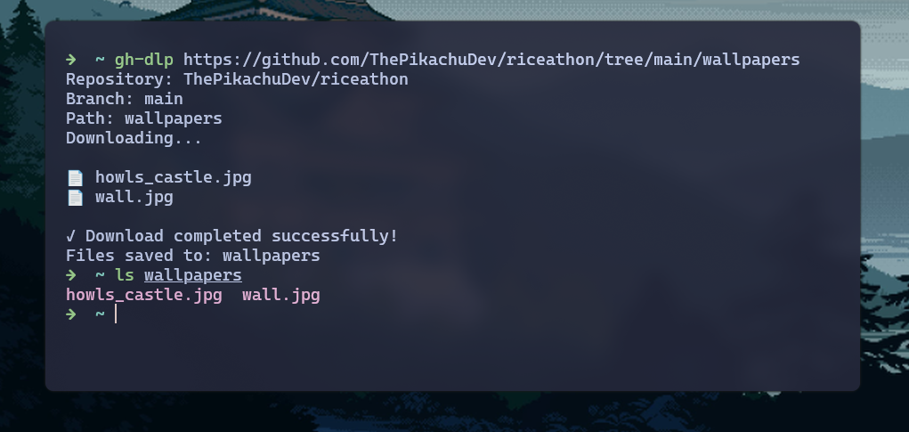
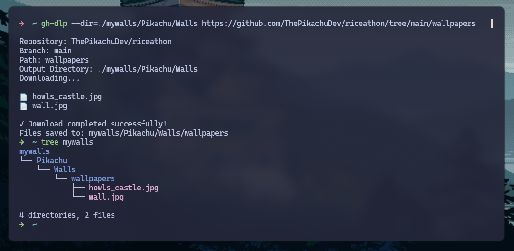

# gh-dlp

A fast and lightweight CLI tool for downloading GitHub repo's subfolders easily




## 📦 Installation

### From Source

### Download respective binary according to your OS from [Releases](https://github.com/ThePikachuDev/gh-dlp/releases) Page ( recommended)


```bash
git clone https://github.com/ThePikachuDev/gh-dlp
cd gh-dlp
go build -o gh-dlp main.go
```

### Using Go Install

```bash
go install github.com/ThePikachuDev/gh-dlp@latest
```

- copy paste your gh-dlp binary to your $PATH directory

- or just run it directly from the cloned directory
 
## 🛠️ Usage

```bash
# this will download the subfolder in your current directory
gh-dlp <Path_To_Github_Repo>
```

Example Usage: 

- Use -d or --dir flags to download to specific directory .You can also do -d=path/to/dir or --dir=path/to/dir as well. They all are basically the same thing.



```bash
# Download to current directory (default behavior)
gh-dlp https://github.com/ThePikachuDev/riceathon/tree/main/wallpapers
# Creates: ./wallpapers/

# Download to specific directory
gh-dlp -d ./downloads https://github.com/ThePikachuDev/riceathon/tree/main/wallpapers
# Creates: ./downloads/wallpapers/

# Download to absolute path
gh-dlp --dir=./mywalls/Pikachu/Walls https://github.com/ThePikachuDev/riceathon/tree/main/wallpapers
# Tree View : 
#mywalls
#└── Pikachu
#    └── Walls
#       └── wallpapers
#           ├── howls_castle.jpg
#           └── wall.jpg
```

### Command Options

```
Usage: gh-dlp [options] <github-repo-link>

Download a specific folder from a GitHub repository.

Options:
  -d, --dir <path>    Download to specific directory (default: current directory)

Examples:
  gh-dlp https://github.com/ThePikachuDev/riceathon/tree/main/wallpapers
  
  gh-dlp -d ./downloads https://github.com/ThePikachuDev/riceathon/tree/main/wallpapers
  
  gh-dlp --dir=/home/user/projects https://github.com/ThePikachuDev/riceathon/tree/main/wallpapers

The tool will create a folder with the same name as the target directory.
Note: Only works with public repositories.
```

## 📄 License

This project is licensed under the Apache 2.0 License - see the [LICENSE.md](LICENSE.md) file for details.

---

**Made with ❤️ by [Pikachu](https://github.com/ThePikachuDev)** 
